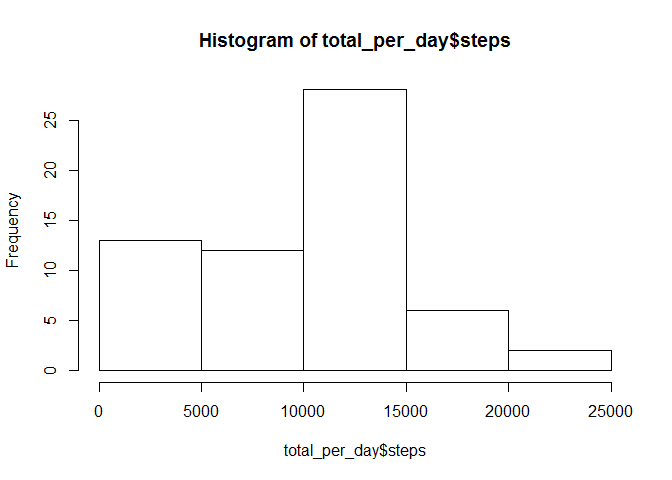
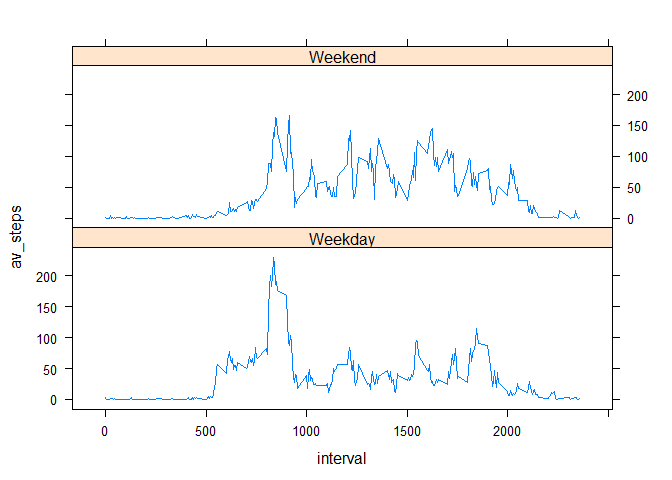

# Reproducible Research: Peer Assessment 1


## Loading and preprocessing the data
As the file is zipped, I'll use read_csv() from the readr package to read in the data. 
The package dplyr is loaded to allow grouping for later summarizing activities.  
In the whole assignment, I will use plotting functionalities from the base package as well as ggplot2 and lattice. 

```r
library(readr)
activity <- read_csv("activity.zip")
```

```
## Parsed with column specification:
## cols(
##   steps = col_integer(),
##   date = col_date(format = ""),
##   interval = col_integer()
## )
```

```r
library(dplyr)
```

```
## 
## Attaching package: 'dplyr'
```

```
## The following objects are masked from 'package:stats':
## 
##     filter, lag
```

```
## The following objects are masked from 'package:base':
## 
##     intersect, setdiff, setequal, union
```

```r
library(ggplot2)
library(lattice)
```

## What is mean total number of steps taken per day?

```r
# group the activity data by date to allow a calculation of the daily sums
act_grpby_date <- group_by(activity,date)
total_per_day <- summarize(act_grpby_date,steps = sum(steps, na.rm = TRUE))
# create a histogram of the daily sums. 
hist(total_per_day$steps)
```

<!-- -->
 


```r
# calculating the mean, as.integer is used to have a nicer output in the text.
mean_steps <- as.integer(mean(total_per_day$steps))
# calculating the mean, as.integer is used to have a nicer output in the text.
median_steps <- as.integer(median(total_per_day$steps))
```
The mean value of steps, taken per day is **9354**.  
The median value of steps, taken per day is **10395**.


## What is the average daily activity pattern?
This plot is pretty straightforward. I used the base plotting system here.

```r
# group the activity data by interval
act_grpby_interval <- group_by(activity,interval)
# calculate the mean of each interval
mean_per_interval <- summarize(act_grpby_interval,av_steps = mean(steps, na.rm = TRUE))
# create the plot
plot(mean_per_interval$interval,
     mean_per_interval$av_steps,
     type="l",
     xlab = "Interval",
     ylab = "Average steps")
```

<!-- -->


```r
# what is the maximum average of all intervals?
max_average <- as.numeric(max(mean_per_interval$av_steps))
# what interval has this value?
max_interval <- mean_per_interval$interval[mean_per_interval$av_steps == max_average]
```
The 5-minute interval **835** contains the maximumn number of steps, on average of all days. This matches fine with the plot.

## Imputing missing values
First of all, how many NAs are there in the data?

```r
count_NAs <- sum(is.na(activity$steps))
```
There are **2304** missing values that have to be taken care of.  
Having looked at the data, the missing values are not scattered across the data. There are a few days with mostly (or only) missing values, all other days seem to be fine. Therefore, an approach to use the mean of that day wouldn't work, as there is no mean value for that day.
Due to this, my approach to fill the missing values is to use the mean value of exactly that 5 min interval of all measurements. The NA is filled with an average value taken from the whole measurement period.

```r
# make an exact copy of the activity data, the copy will be changed within the for loop
activity_filled <- activity
# for all entries in activity...
for(i in 1:nrow(activity)){
    # ...check for NAs...
    if(is.na(activity$steps[i])){
        #... read the mean for that interval...
        loc_mean_5min <- 
            mean_per_interval$av_steps[mean_per_interval$interval == 
                                         activity$interval[i]]
        # just to be sure, if there is still an NA, set the value to 0
        if(is.na(loc_mean_5min)){ loc_mean_5min <- 0 }
        # ...fill the steps in the copied data with the mean of that interval
        activity_filled$steps[i] <- loc_mean_5min
    }
}
# just to be sure, calculate the missing values in the "filled" dataset
count_NAs <- sum(is.na(activity_filled$steps))
```
Now, there are **0** missing values left. That's good.  
  
Now for the plot, which is created in the same way as the one above, only with different data.

```r
# group the filled data by date
filled_grpby_date <- group_by(activity_filled,date)
# summarize the steps by date
filled_total_per_day <- 
    summarize(filled_grpby_date,steps = sum(steps))
# create the plot
hist(total_per_day$steps)
```

<!-- -->
  

Now, calculate the mean and the median for the data set without missing values.  

```r
# calculate the mean, again as.integer for having an integer value that fits
# nicer into the output
mean_steps <- as.integer(mean(filled_total_per_day$steps))
# calculate the median.
median_steps <- as.integer(median(filled_total_per_day$steps))
```
The mean value of steps, taken per day is **10766**.  
The median value of steps, taken per day is **10766**.  
My method of filling the missing values seems to have changed the data as not only the median has changed, but the mean is the same value as the median. 

## Are there differences in activity patterns between weekdays and weekends?
I have to enrich the dataset with the days first and then decide, whether they are a weekday or a weekend.

```r
# get an additional column containing the day of week
activity_filled <- mutate(activity_filled, weekday = weekdays(date))
# now, substitute each day with the value "Weekday" or "Weekend". As I'm using a 
# German locale of R, the weekdays are in German as well
activity_filled$weekday[activity_filled$weekday == "Montag"] <- "Weekday"
activity_filled$weekday[activity_filled$weekday == "Dienstag"] <- "Weekday"
activity_filled$weekday[activity_filled$weekday == "Mittwoch"] <- "Weekday"
activity_filled$weekday[activity_filled$weekday == "Donnerstag"] <- "Weekday"
activity_filled$weekday[activity_filled$weekday == "Freitag"] <- "Weekday"
activity_filled$weekday[activity_filled$weekday == "Samstag"] <- "Weekend"
activity_filled$weekday[activity_filled$weekday == "Sonntag"] <- "Weekend"
# change the column weekday to be a factor
activity_filled$weekday <- as.factor(activity_filled$weekday)
# group the dataset by interval and weekday
filled_grpby_int_wday <- group_by(activity_filled,interval,weekday)
# summarize the steps, calculate the mean
filled_mean_per_interval <- summarize(filled_grpby_int_wday,
                                 av_steps = mean(steps))
# create the plot. I use lattice here as the example obviously did the same.
with(filled_mean_per_interval,xyplot(av_steps ~ interval | weekday, 
                                type = "l", 
                                layout = c(1,2)))
```

<!-- -->
  
So, all set and done.
